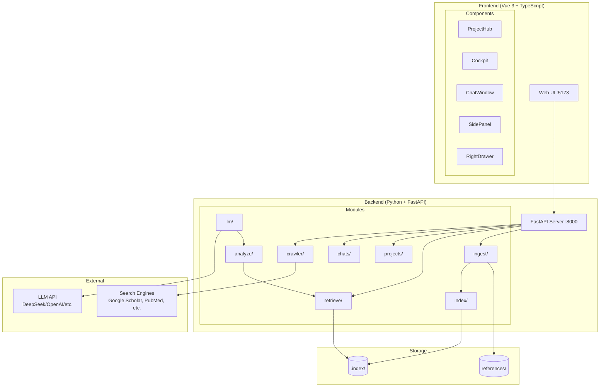
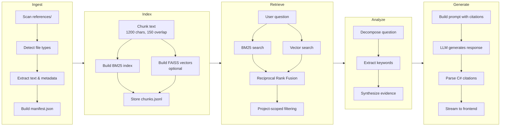
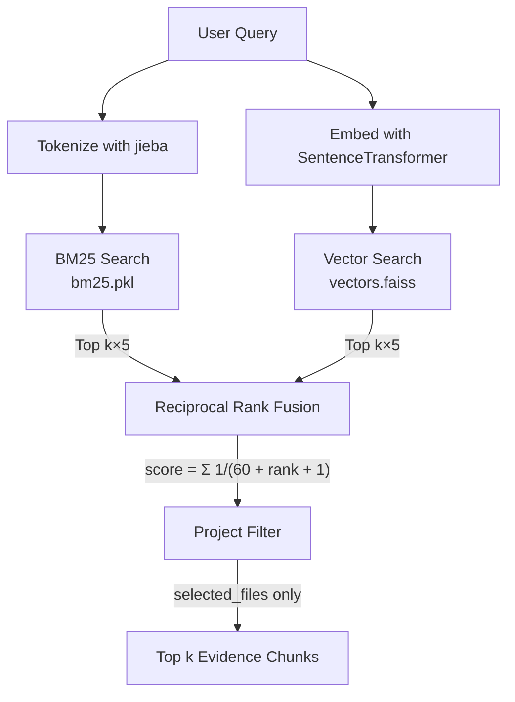
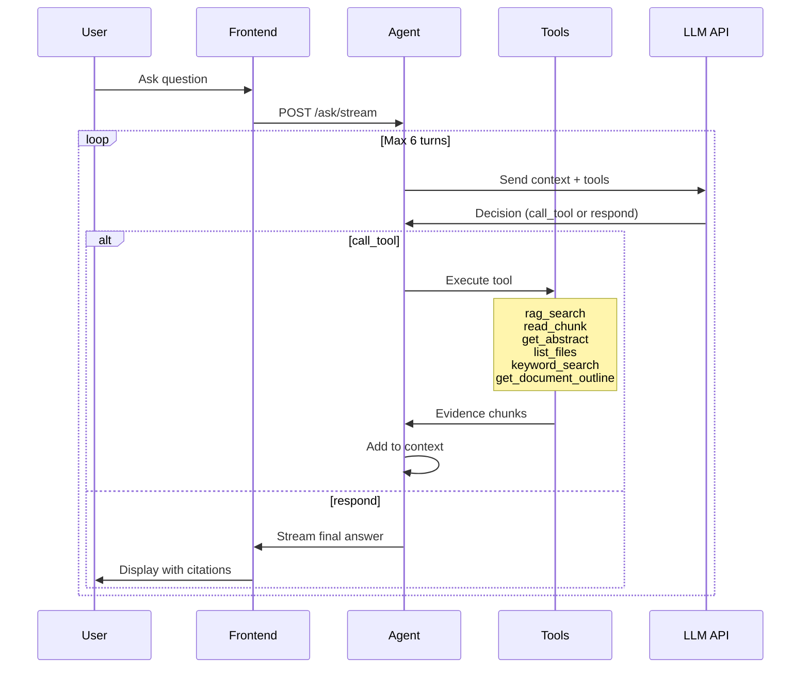

# ReferenceMiner

ReferenceMiner is a local research assistant designed to deliver deep, evidence-grounded analysis over a curated set of references you provide.

ReferenceMiner operates primarily on your local `references/` folder containing PDFs, DOCX files, images, charts, and other research artifacts. Every claim it produces is traceable to a specific file, page, section, or figure.

**Principle: If it is not in `references/`, it does not exist.**

---

## Documentation Map

- `README.md` - product overview, architecture, startup flow
- `ENDPOINTS.md` - complete backend API reference with payload examples
- `CRAWLER.md` - crawler architecture, limits, and engine behavior
- `docs/SELECTOR_STRATEGIES.md` - selector extraction strategies for document parsing

---

## Core Capabilities

- **Folder awareness** — Knows exactly what files exist in `references/`, their types, structure, and metadata.
- **Document understanding** — Extracts titles, abstracts, sections, and full text from PDFs and DOCX files. Tracks page numbers and section boundaries.
- **Metadata extraction** — Heuristic extraction of bibliographic metadata (title, authors, year, DOI) with specialized support for Chinese academic journals.
- **Chart and figure interpretation** — Uses surrounding text and captions by default. Can fall back to vision-based analysis on demand.
- **Hybrid retrieval** — Combines keyword search (BM25) and semantic search (vector embeddings) with reciprocal rank fusion.
- **Deep analytical responses** — Breaks questions into sub-questions, synthesizes across multiple sources, identifies agreements, contradictions, and gaps.
- **Strict grounding** — Every factual statement is backed by an explicit citation: `(paper1.pdf p.7, Fig.2)` or `(survey.docx §3.1)`

---

## Design Philosophy

ReferenceMiner's core philosophy is **local-first, user-controlled**:

- **Primary mode**: Analyze documents you explicitly provide in `references/`
- **Crawler as discovery tool**: Optional web crawler helps discover papers, but requires user responsibility
- **No external content in analysis**: LLM cannot fetch external content during analysis
- **No hallucinations**: System never makes uncited claims or invents sources

This keeps the system auditable, reproducible, and suitable for academic or professional use.

---

## Web Crawler (Optional Feature)

ReferenceMiner includes an **optional web crawler** to help discover and download research papers. This feature is **disabled by default** and requires explicit user activation.

### User Responsibility

By enabling the crawler, you acknowledge:

- **Terms of Service Compliance**: Google Scholar uses web scraping which may violate their ToS. You are responsible for ensuring compliance.
- **API Rate Limits**: Other engines use public APIs with rate limits. Respect these limits.
- **Content Verification**: Downloaded papers should be reviewed before inclusion in your reference collection.

### Available Engines

| Engine           | Type         | API Key Required | Rate Limit (default) |
| ---------------- | ------------ | ---------------- | -------------------- |
| Google Scholar   | Web scraping | No               | 5 req/min            |
| PubMed           | API          | No               | 10 req/min           |
| Semantic Scholar | API          | No               | 1 req/min            |
| arXiv            | API          | No               | 10 req/min           |
| Crossref         | API          | No               | 10 req/min           |
| OpenAlex         | API          | No               | 10 req/min           |
| CORE             | API          | **Yes**          | 5 req/min            |
| Europe PMC       | API          | No               | 10 req/min           |
| bioRxiv/medRxiv  | API          | No               | 5 req/min            |

### How It Works

1. **Search**: Query multiple engines concurrently, deduplicate results
2. **Review**: Preview titles, abstracts, authors, and metadata
3. **Select**: Choose which papers to download
4. **Download**: PDFs saved to `references/` and automatically indexed
5. **Analyze**: Papers become part of your local corpus for LLM analysis

**Important**: The crawler is a discovery tool, not a replacement for your curated reference collection. Downloaded papers should be reviewed and organized manually.

---

## Architecture Overview



---

## Data Flow Pipeline



---

## Hybrid Retrieval System



The retrieval system combines two search strategies for robust results:

1. **BM25 Search** — Query is tokenized with jieba (CJK-aware) and scored against the keyword index. Returns top k×5 candidates.

2. **Vector Search** — Query is embedded with SentenceTransformer (all-MiniLM-L6-v2) and matched via FAISS cosine similarity. Returns top k×5 candidates.

3. **Reciprocal Rank Fusion** — Both result sets are merged using RRF: `score = Σ 1/(60 + rank + 1)`. This combines rankings without parameter tuning.

4. **Project Filtering** — Results are filtered to only include files in `selected_files`, then the top k chunks are returned with bounding boxes for PDF highlighting.

---

## Frontend Architecture

The Vue 3 frontend has two main views:

**ProjectHub** (`/`) — Landing page with project cards and settings configuration.

**Cockpit** (`/project/:id`) — Main 3-panel research interface:

- **SidePanel** (left) — File browser with upload/selection, chat session list, pinned notes
- **ChatWindow** (center) — Message history with streaming responses, input area
- **RightDrawer** (right) — PDF viewer with highlight rendering, notebook for pinned evidence

**Modal System** — All modals extend `BaseModal.vue` with consistent animations, ESC-to-close, and click-outside handling. Includes `FilePreviewModal`, `ConfirmationModal`, `AlertModal`, and `BankFileSelectorModal`.

---

## Agentic Tool Calling



The agent operates in a multi-turn loop (max 6 turns, 10 tool calls):

1. **Send context** — The agent receives the question, chat history, and available tools.

2. **LLM decides** — Returns either `call_tool` (needs more info) or `respond` (ready to answer).

3. **Tool execution** — If `call_tool`, the agent executes one of:
   - `rag_search` — Semantic + keyword search across documents
   - `read_chunk` — Retrieve specific chunks by ID with surrounding context
   - `get_abstract` — Fetch document abstract/summary
   - `list_files` — List available documents with metadata
   - `keyword_search` — Exact term matching (better for author names, acronyms, identifiers)
   - `get_document_outline` — Return document's section outline (headings + structure)

4. **Accumulate evidence** — Tool results are added to context for the next turn.

5. **Stream response** — When ready, the agent streams the final answer with `[C#]` citations mapped to evidence chunks.

---

## Project Structure

```
ReferenceMiner/
├── references/              # User's document bank
├── src/refminer/            # Python backend
│   ├── ingest/              # Document extraction
│   │   ├── extract_pdf.py   # PyMuPDF with bbox mapping
│   │   ├── extract_docx.py  # python-docx parser
│   │   ├── extract_image.py # Image metadata
│   │   ├── manifest.py      # ManifestEntry builder
│   │   └── incremental.py   # Change detection
│   ├── index/               # Search indexes
│   │   ├── chunk.py         # Sliding window chunker
│   │   ├── bm25.py          # BM25Okapi with jieba
│   │   └── vectors.py       # FAISS + SentenceTransformer
│   ├── retrieve/            # Hybrid search
│   │   ├── hybrid.py        # Reciprocal rank fusion
│   │   └── search.py        # Query interface
│   ├── analyze/             # Question processing
│   │   └── workflow.py      # Decompose, synthesize
│   ├── llm/                 # LLM integration
│   │   ├── agent.py         # Multi-turn tool calling
│   │   ├── openai_compatible.py  # Streaming generation
│   │   └── prompts/         # System prompts
│   ├── projects/            # Project CRUD
│   ├── chats/               # Session persistence
│   ├── settings/            # API key management
│   └── server.py            # FastAPI app
├── frontend/src/            # Vue 3 frontend
│   ├── components/          # Vue SFCs
│   ├── api/client.ts        # API client
│   └── types.ts             # TypeScript interfaces
└── .index/                  # Generated data
    ├── manifest.json        # File metadata
    ├── chunks.jsonl         # Text chunks
    ├── bm25.pkl             # BM25 index
    ├── vectors.faiss        # Vector index
    ├── projects.json        # Project metadata
    └── chats/               # Per-project sessions
```

---

## Core Data Structures

**ManifestEntry** — File metadata stored in `manifest.json`:

```python
path, rel_path, file_type, size_bytes, modified_time, sha256, title, abstract, page_count
```

**Chunk** — Text segment created during indexing:

```python
chunk_id, path, text, page, section, bbox  # bbox enables PDF highlighting
```

**EvidenceChunk** — Chunk with retrieval score, passed to LLM:

```python
chunk_id, path, page, section, text, score, bbox
```

**Project** — Lightweight metadata overlay:

```python
id, name, root_path, created_at, last_active, file_count, selected_files
```

**ChatMessage** — Stored in per-project session files:

```python
id, role, content, timestamp, sources, keywords, isStreaming
```

Data flows: `ManifestEntry` → extracted into `Chunk` → scored as `EvidenceChunk` → cited in `ChatMessage`

---

## Metadata Extraction

ReferenceMiner automatically extracts bibliographic metadata from PDFs during ingestion. The extraction supports both Western and Chinese academic journals.

### Supported Fields

| Field      | Description               | Example                                           |
| ---------- | ------------------------- | ------------------------------------------------- |
| `title`    | Document title            | "老有所学"能否促进"老有所为"                      |
| `authors`  | List of author names      | [{"literal": "黄家乐"}, {"literal": "宋亦芳"}]    |
| `year`     | Publication year          | 2025                                              |
| `doi`      | Digital Object Identifier | 10.1234/example                                   |
| `doc_type` | Document type code        | J (journal), M (book), C (conference), D (thesis) |
| `language` | Detected language         | "zh" or "en"                                      |

### Chinese Journal Support

Specialized heuristics for Chinese academic journals (CNKI, Wanfang, VIP, etc.):

- **Author formats**: `□黄家乐¹˒² 宋亦芳¹˒²` with affiliation superscripts
- **Publication year**: Extracted from `文章编号：1001-7518（2025）12-077-11`
- **Author bios**: Falls back to `作者简介：黄家乐（1993—），女，...` pattern
- **Language detection**: Automatic CJK character detection

### Re-extracting Metadata

In the web UI, open the file's metadata modal and click **Extract** to re-run extraction. This replaces existing metadata with fresh extraction results.

API endpoint:

```bash
# Replace existing metadata
POST /api/files/{rel_path}/metadata/extract?force=true

# Merge with existing (fill gaps only)
POST /api/files/{rel_path}/metadata/extract
```

---

## Startup Guide

### 1. Python Backend Setup

This project uses `uv` for dependency management:

```bash
uv sync
uv run python referenceminer.py ingest
uv run python -m uvicorn refminer.server:app --reload --app-dir src --port 8000
```

### 2. Configure LLM Provider

LLM settings are configured through the web UI in the **Settings** page (accessible from ProjectHub). Supported providers: DeepSeek, OpenAI, Gemini, Anthropic, or any OpenAI-compatible API.

Settings are stored in `.index/settings.json` and persist across sessions.

### 3. Start the Vue Frontend

```bash
cd frontend
npm install
npm run dev
```

Optionally create `frontend/.env` if the backend runs on a different port:

```bash
VITE_API_URL=http://localhost:8000
```

Open `http://localhost:5173` and configure your LLM provider in Settings.

---

## Development Verification

Run these checks before opening a PR:

```bash
# Backend tests
uv run python -m unittest discover tests

# Frontend typecheck + production build
cd frontend
npm run build
```

If you only need frontend type-checking without a build artifact:

```bash
cd frontend
npx vue-tsc --noEmit
```

---

## API Endpoints

| Category     | Endpoint                                                 | Description                     |
| ------------ | -------------------------------------------------------- | ------------------------------- |
| **Projects** | `GET /api/projects`                                      | List all projects               |
|              | `POST /api/projects`                                     | Create project                  |
|              | `GET /api/projects/{id}`                                 | Get project details             |
|              | `DELETE /api/projects/{id}`                              | Delete project                  |
|              | `POST /api/projects/{id}/activate`                       | Update last_active timestamp    |
| **Chats**    | `GET /api/projects/{id}/chats`                           | List sessions                   |
|              | `POST /api/projects/{id}/chats`                          | Create session                  |
|              | `GET /api/projects/{id}/chats/{sid}`                     | Get session with messages       |
|              | `PUT /api/projects/{id}/chats/{sid}`                     | Update session                  |
|              | `DELETE /api/projects/{id}/chats/{sid}`                  | Delete session                  |
|              | `POST /api/projects/{id}/chats/{sid}/messages`           | Add message                     |
|              | `PATCH /api/projects/{id}/chats/{sid}/messages`          | Update message                  |
| **Q&A**      | `POST /api/projects/{id}/ask`                            | Non-streaming answer            |
|              | `POST /api/projects/{id}/ask/stream`                     | Streaming answer (SSE)          |
|              | `POST /api/projects/{id}/summarize`                      | Generate chat title (SSE)       |
| **Files**    | `GET /api/projects/{id}/manifest`                        | Get project manifest            |
|              | `GET /api/projects/{id}/files`                           | Get selected files              |
|              | `POST /api/projects/{id}/files/select`                   | Add files to project            |
|              | `POST /api/projects/{id}/files/remove`                   | Remove files from project       |
|              | `GET /api/projects/{id}/status`                          | Get index statistics            |
|              | `POST /api/projects/{id}/upload/stream`                  | Upload with progress (SSE)      |
|              | `GET /api/projects/{id}/files/check-duplicate`           | Check duplicate by hash         |
|              | `POST /api/projects/{id}/files/{rel_path}/delete/stream` | Delete file (SSE)               |
|              | `POST /api/projects/{id}/files/batch-delete`             | Batch delete files              |
|              | `POST /api/projects/{id}/files/batch-delete/stream`      | Batch delete (SSE)              |
|              | `GET /api/files/{rel_path}/highlights`                   | Get PDF highlights              |
|              | `GET /api/files/{rel_path}/metadata`                     | Get file metadata               |
|              | `PATCH /api/files/{rel_path}/metadata`                   | Update file metadata            |
|              | `POST /api/files/{rel_path}/metadata/extract`            | Extract metadata from PDF       |
| **Bank**     | `GET /api/bank/manifest`                                 | Get all files in bank           |
|              | `GET /api/bank/files/stats`                              | Get file usage statistics       |
|              | `POST /api/bank/upload/stream`                           | Upload to bank (SSE)            |
|              | `POST /api/bank/reprocess/stream`                        | Rebuild all indexes (SSE)       |
|              | `POST /api/bank/files/{rel_path}/reprocess/stream`       | Reprocess single file (SSE)     |
| **Crawler**  | `GET /api/crawler/engines`                               | List available engines          |
|              | `GET /api/crawler/config`                                | Get crawler configuration       |
|              | `POST /api/crawler/config`                               | Update crawler configuration    |
|              | `POST /api/crawler/search`                               | Search across engines           |
|              | `POST /api/crawler/download`                             | Download PDFs from results      |
|              | `POST /api/crawler/batch-download/stream`                | Batch download (SSE)            |
| **Settings** | `GET /api/settings`                                      | Get current settings            |
|              | `GET /api/settings/version`                              | Get app version                 |
|              | `GET /api/settings/update-check`                         | Check for updates               |
|              | `POST /api/settings/api-key`                             | Save API key                    |
|              | `DELETE /api/settings/api-key`                           | Delete API key                  |
|              | `POST /api/settings/validate`                            | Validate key                    |
|              | `POST /api/settings/models`                              | Fetch available models          |
|              | `POST /api/settings/llm`                                 | Save LLM configuration          |
|              | `POST /api/settings/citation-format`                     | Save citation format            |
|              | `POST /api/settings/reset`                               | Reset all data (preserves refs) |
| **Queue**    | `GET /api/queue/jobs`                                    | List queue jobs                 |
|              | `GET /api/queue/jobs/{job_id}`                           | Get specific job                |
|              | `POST /api/queue/jobs`                                   | Create queue job                |
|              | `GET /api/queue/stream`                                  | Stream job events (SSE)         |

---

## Key Design Patterns

### Reference Bank Model

Single `references/` directory shared across projects. Files never deleted—only index entries cleared. Projects are lightweight views that select subsets of files.

### Hybrid Retrieval

BM25 for exact term matching + vector embeddings for semantic similarity. Reciprocal Rank Fusion combines rankings without parameter tuning.

### Project-Scoped Queries

Global index, local filtering. Queries filtered by `selected_files` at retrieval time. Same index serves all projects.

### Agentic Tool Calling

Multi-turn architecture where LLM decides when to retrieve vs respond. Tools: `rag_search`, `read_chunk`, `get_abstract`.

### SSE Streaming

Real-time updates for uploads and Q&A responses without polling.

### Citation Tracking

[C#] markers in responses mapped to evidence chunks. Bounding boxes enable PDF highlighting at exact text locations.

---

## CLI Usage

```bash
uv run python referenceminer.py list
uv run python referenceminer.py ask "What evidence supports method X?"
uv run python referenceminer.py ingest --no-vectors  # Skip vector indexing
```

### Crawler Stats Script

The `scripts/pdf_stats.py` utility reports PDF coverage ratios for crawler engines.

```bash
# List engines
uv run python scripts/pdf_stats.py --list-engines

# Run enabled engines
uv run python scripts/pdf_stats.py --query "Distill"

# Run all engines
uv run python scripts/pdf_stats.py --all --query "Distill"

# Run specific engines (repeatable or comma-separated)
uv run python scripts/pdf_stats.py --engine pubmed --engine openalex
uv run python scripts/pdf_stats.py --engine "pubmed,openalex"
```

---

## Version Management

Set the version across all package files (Python + npm):

```bash
scripts\set_version.bat 1.0.0
# or
python scripts/set_version.py 1.0.0
```

This updates:

- `src/refminer/version.py` (APP_VERSION)
- `package.json`
- `frontend/package.json`
- `installer/package.json`

---

## Example Queries

- "Summarize the consensus and disagreements across these papers."
- "Which figures support the claim that X improves Y?"
- "Compare the methodologies used in papers A, B, and C."
- "What assumptions are shared across all sources?"
- "What evidence contradicts hypothesis H?"

---

## Intended Use Cases

- Literature reviews
- Research validation
- Technical due diligence
- Academic writing support
- Internal knowledge audits

---

> **ReferenceMiner** — If it is not cited, it does not count.

---

## Offline Installer (Custom UI)

The offline installer lives in `installer/` and bundles a payload from the built desktop app + backend.

Build steps:

```bash
# 1) Build backend + desktop app (existing flow)
build.bat

# 2) Stage offline payload for the custom installer
powershell -ExecutionPolicy Bypass -File scripts/prepare-offline-payload.ps1

# 3) Build the installer UI app
cd installer
npm install
npm run build
```
